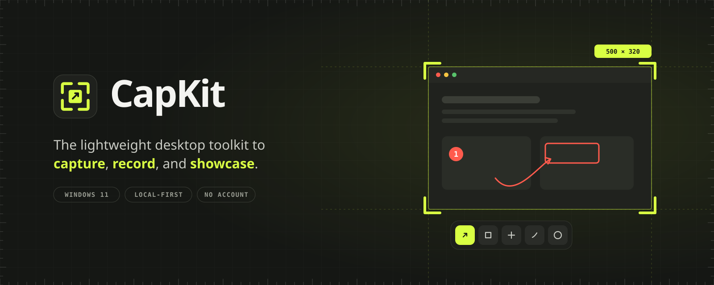
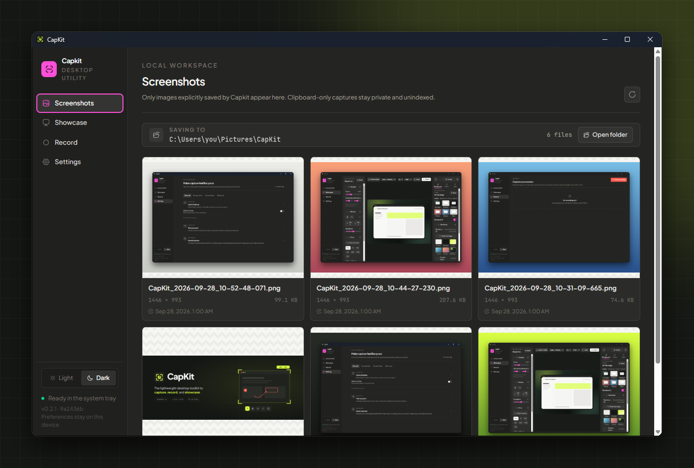
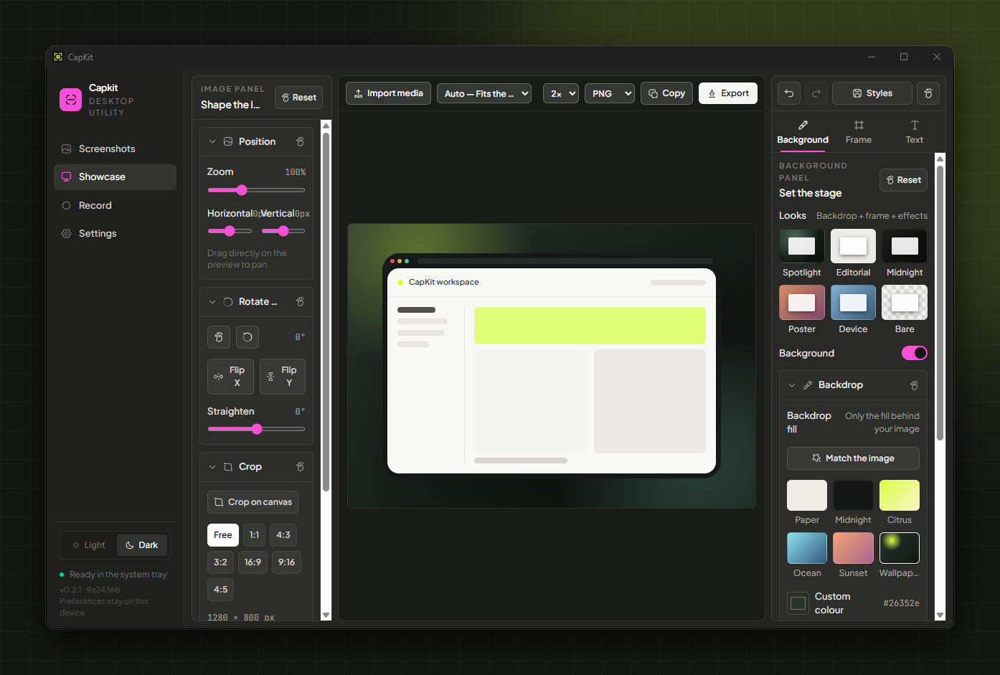
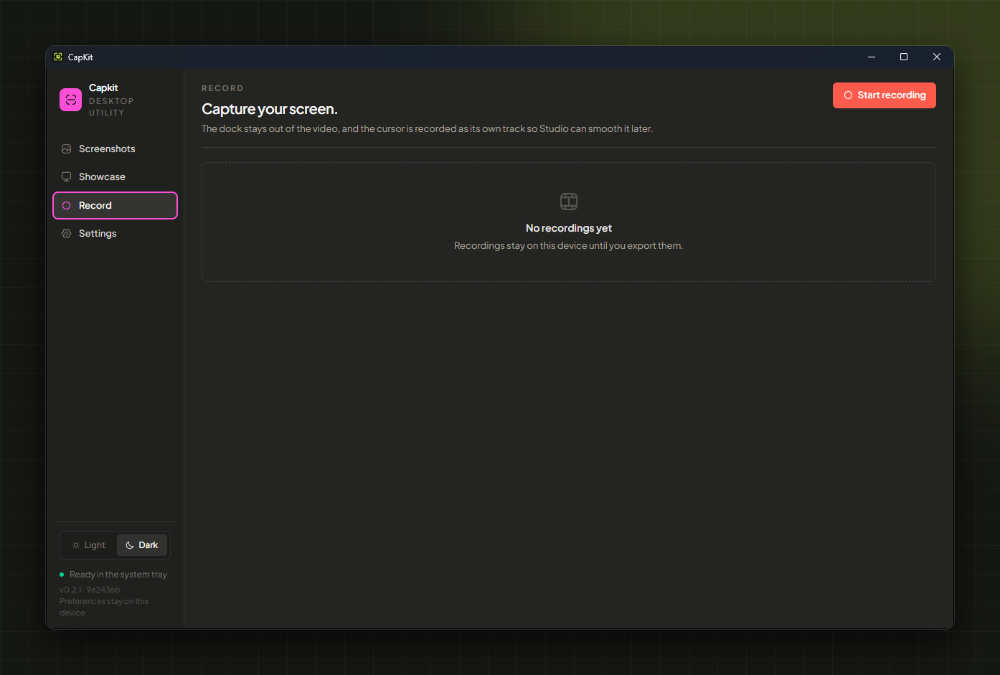
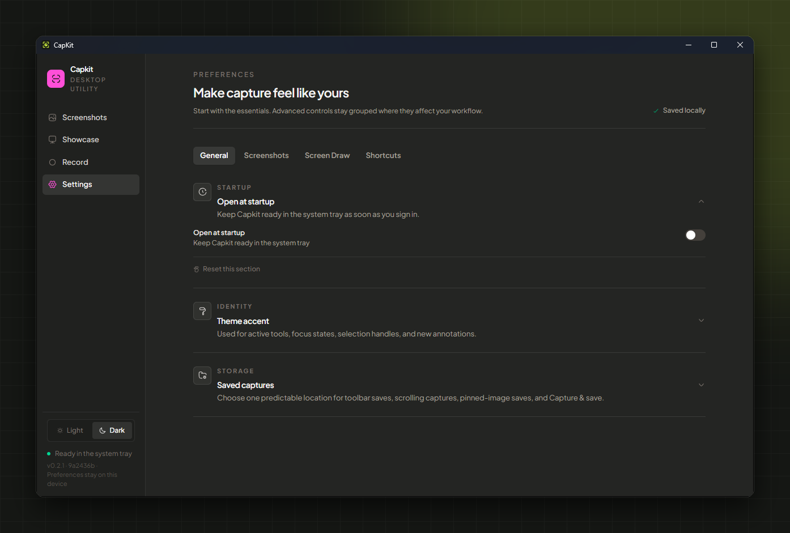

<p align="center">
  
</p>

<p align="center">
  <a href="https://github.com/imnakul/snaphub/releases/latest"></a>
  
  
  <a href="LICENSE"></a>
</p>

<p align="center">
  <a href="https://github.com/imnakul/snaphub/releases/latest"><b>Download for Windows</b></a>
  &nbsp;·&nbsp;
  <a href="https://capkit.nakulsrivastava.com/">Website</a>
  &nbsp;·&nbsp;
  <a href="CHANGELOG-PUBLIC.md">What's new</a>
</p>

---

CapKit is a small desktop app that lives in your system tray. Press a shortcut, select part of the screen, mark it up right where it is, then copy, save, or pin it, and get back to work. No editor window, no account, no cloud.

When you need more, the same app records your screen, turns recordings into polished clips, and dresses screenshots up for sharing.

```text
Shortcut  →  select on a frozen screen  →  edit in place  →  copy · save · pin  →  back to work
```

## Screenshots

<p align="center">
  
</p>

<table>
  <tr>
    <td width="50%"></td>
    <td width="50%"></td>
  </tr>
  <tr>
    <td align="center"><b>Showcase</b>: frame a capture for sharing</td>
    <td align="center"><b>Record</b>: record and edit your screen</td>
  </tr>
  <tr>
    <td colspan="2"></td>
  </tr>
  <tr>
    <td colspan="2" align="center"><b>Settings</b>: shortcuts, colors and toolbar options, stored on your device</td>
  </tr>
</table>

## Features

### Capture

- **One shortcut, frozen screen.** `Alt+Shift+S` freezes the display under your cursor so menus and tooltips stay put while you select.
- **Smart selection.** Drag a region, click a window, or click an individual button or panel inside an app. Resize and move the selection after drawing it.
- **Precision aids.** Crosshair, live dimensions, a magnifier and snapping, each of which you can turn off.
- **Scrolling capture.** Capture a whole long page automatically, or scroll by hand. CapKit stitches the frames and handles sticky headers.
- **Direct shortcuts.** Separate shortcuts for Capture & Copy and Capture & Save when you don't need to edit.

### Edit in place

The selected area becomes the editor. Tools appear right beside it.

- Rectangle, ellipse, line, straight and curved arrows, highlighter, pencil, spotlight, numbered steps and text, including a handwritten style.
- **Redaction that sticks.** Blur, pixelate and black out. Protected areas are permanently flattened into the exported image.
- Select, move and delete anything you drew, with full undo and redo.
- Finish with **Copy** (`C`), **Copy & Save** (`A`), **Save** (`S`) or **Pin**.
- Arrange the toolbar your way: one row of tools, or grouped rows you order yourself.

### Pin

- Keep a capture floating above everything: move, resize, rotate, change the opacity, lock it, then copy or save it later.

### Screen Draw

- A separate shortcut puts a drawing layer over your live screen, for demos, calls and teaching.
- Pen, text, shapes, arrows, spotlight, magnifier, a laser pointer that fades, eraser and blur.
- Press `S` to save the whole screen with your drawings.

### Record and edit

- Record a display, a single window, or an area you draw.
- Choose your microphone and speaker. The recording controls stay out of the video.
- The cursor is recorded as its own track, so the editor can smooth it and zoom in automatically on clicks.
- Trim, add a webcam bubble, apply a Showcase look, and export to MP4 or GIF.

### Showcase

- Turn a plain screenshot into something worth posting: backgrounds, gradients and wallpapers; padding, rounded corners and shadows; browser and device frames; tilt and perspective; titles and notes.
- Save your favourite looks as presets.

### Private by design

- Everything stays on your device. No account, sign-in, telemetry or network access is needed to capture, edit, record or export.
- CapKit idles in the tray and loads its capture, editing and recording tools only when you use them.

## Install

1. Download `CapKit_<version>_x64-setup.exe` from the [latest release](https://github.com/imnakul/snaphub/releases/latest).
2. Run it. It installs for your user account only and doesn't need admin rights.
3. CapKit starts in the system tray. Press `Alt+Shift+S` to capture.

> [!NOTE]
> The installer isn't code-signed yet, so Windows SmartScreen may show "Windows protected your PC". Choose **More info → Run anyway**. Each release includes a `.sha256` file so you can check the download.

Requirements: Windows 11 (Windows 10 version 2004 or later for screen recording) with the WebView2 runtime, which comes with current Windows. macOS, Ubuntu and Fedora support is planned.

## Development

<details>
<summary>Prerequisites, commands and project layout</summary>

### Prerequisites

- Node.js 24+
- pnpm 11+
- Rust 1.95+
- Windows 11 SDK and WebView2

### Commands

```powershell
pnpm.cmd install          # install dependencies
pnpm.cmd tauri dev        # run the desktop app
pnpm.cmd typecheck
pnpm.cmd lint
pnpm.cmd test
pnpm.cmd bundle:windows   # build the NSIS setup
pnpm.cmd bundle:store     # build the Microsoft Store MSIX package
```

Rust checks:

```powershell
cargo fmt --manifest-path apps/desktop/src-tauri/Cargo.toml --check
cargo clippy --manifest-path apps/desktop/src-tauri/Cargo.toml --all-targets -- -D warnings
cargo test --manifest-path apps/desktop/src-tauri/Cargo.toml
```

The setup is written to `apps/desktop/src-tauri/target/release/bundle/nsis/CapKit_<version>_x64-setup.exe`. Store packaging is described in [Microsoft Store release](docs/microsoft-store-release.md), and publishing a release in [Releasing CapKit](docs/releasing.md).

### Project layout

```text
apps/desktop/            React capture surface and Tauri host
apps/desktop/src-tauri/  Rust resident core and platform adapters
apps/landing-page/       Next.js marketing site
docs/                    Product and engineering source of truth
```

### Stack

Tauri 2 · Rust · React 19 · TypeScript · Vite · Tailwind CSS 4 · Zod · Vitest. The landing page uses Next.js 16.

</details>

## Project status

- **Confirmed:** Windows 11 is the supported, tested platform.
- **Confirmed:** Capture, editing, Screen Draw, recording and export are local-first and need no account or cloud.
- **Provisional:** macOS, Ubuntu and Fedora are architectural targets. Native permissions, packaging and hardware testing are not done yet.
- **Provisional:** Pricing, paid features and distribution channels.

## Documentation

- [Product brief](docs/product-brief.md)
- [Current implementation status](docs/current-status.md)
- [Local feature inventory](docs/local-features.md)
- [Feature roadmap](docs/feature-roadmap.md)
- [Capture UX specification](docs/capture-ux-spec.md)
- [Technical architecture](docs/technical-architecture.md)
- [Performance and quality](docs/performance-quality.md)
- [Business and cloud](docs/business-cloud.md)
- [Brand and marketing handoff](docs/brand-marketing-handoff.md)
- [Decision log](docs/decision-log.md)

## License

Copyright © 2026 Nakul Srivastava. All rights reserved. CapKit is proprietary software; see [LICENSE](LICENSE). Bundled third-party components, such as the Caveat font (SIL Open Font License 1.1), keep their own licenses.
